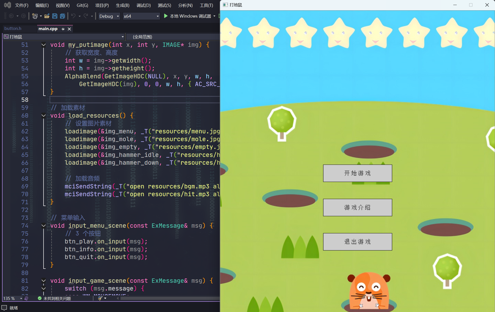

# Whack-a-Mole

一个简单的打地鼠小游戏

**编译环境：** Visual Studio 2022 + EasyX

***

**参考资料：**

- [EasyX 安装](https://blog.csdn.net/Dustinthewine/article/details/129431962)

- Voidmatrix：[C++打地鼠游戏](https://b23.tv/hrjEGMQ)